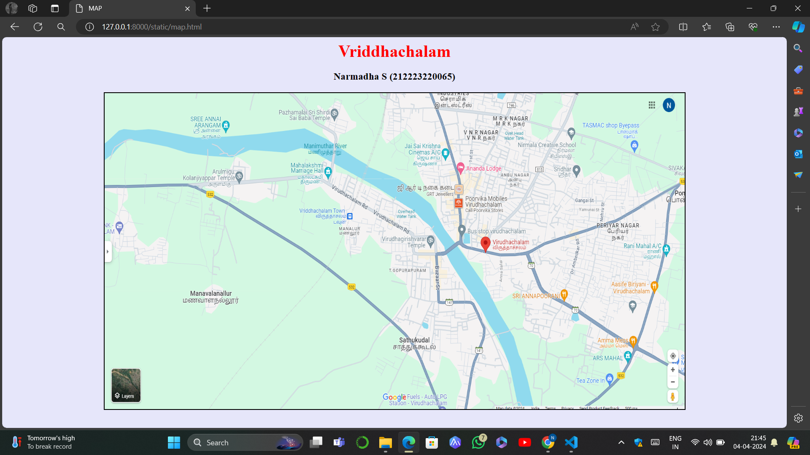
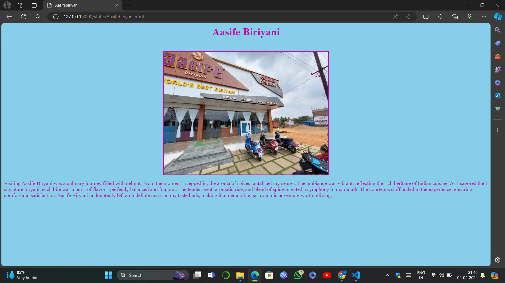
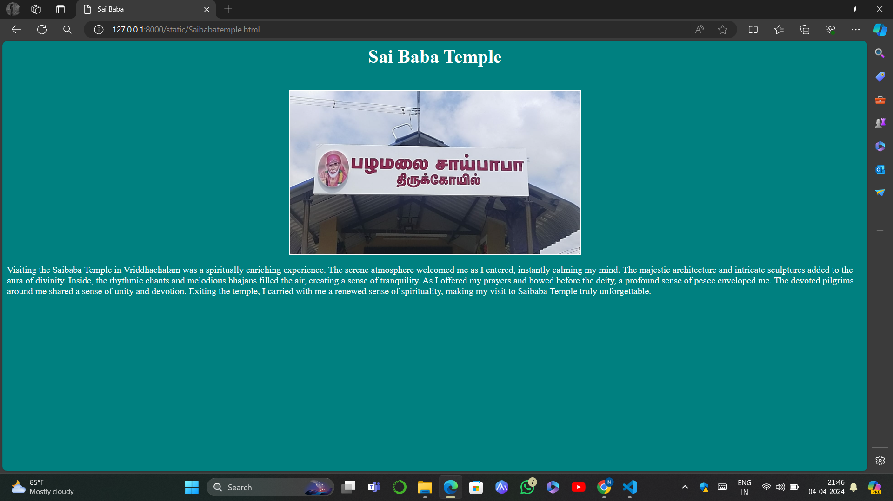
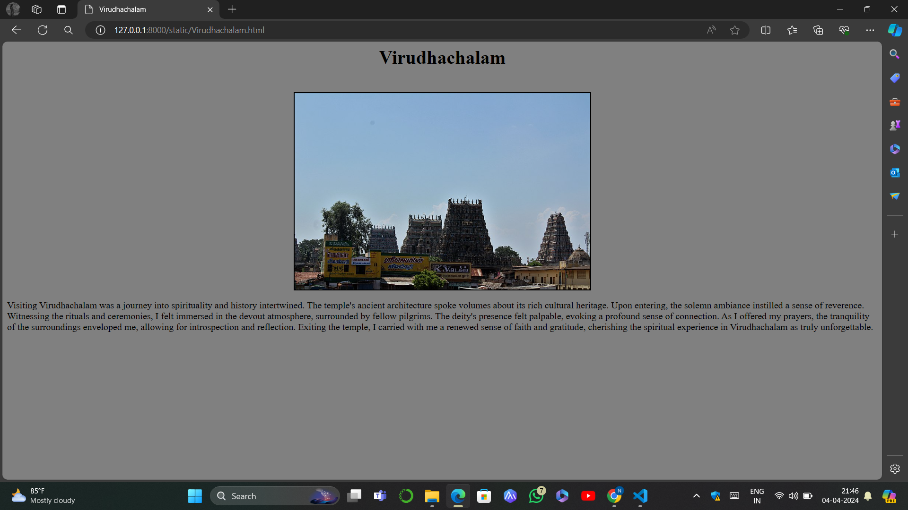
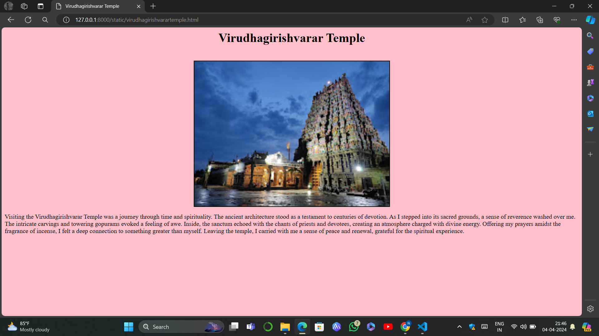

# Ex04 Places Around Me
## Date:04.04.2024 

## AIM
To develop a website to display details about the places around my house.

## DESIGN STEPS

### STEP 1
Create a Django admin interface.

### STEP 2
Download your city map from Google.

### STEP 3
Using ```<map>``` tag name the map.

### STEP 4
Create clickable regions in the image using ```<area>``` tag.

### STEP 5
Write HTML programs for all the regions identified.

### STEP 6
Execute the programs and publish them.

## CODE
```
map.html

<html>
<head>
<title>MAP</title>
</head>
<body bgcolor="lavender">
<center>
<font size="6" color="red"><b>Vriddhachalam</b></font>
<br>
<h3 text="black">Narmadha S (212223220065)</h3>

<map name="MAP">
<area shape="rect" coords="950,350,1050,390" href="Aasifebiriyani.html" title="Aasife Biriyani">
<area shape="rect" coords="150,130,260,175" href="kolanjiyappartemple.html" title="Kolanjiyappar Temple">
<area shape="rect" coords="320,30,440,50" href="Saibabatemple.html" title="Sai Baba Temple">
<area shape="rect" coords="700,270,810,310" href="Virudhachalam.html" title="Virudhachalam">
<area shape="rect" coords="510,270,630,300" href="virudhagirishvarartemple.html" title="Virudhagirishvarar Temple">
</map>
</center>
</body>
</html>

Aasifebiriyani.html

<html>
<head>
<title>Aasifebiriyani</title>
</head>
<body bgcolor="skyblue" text="charcoal">
<center>
<h1>Aasife Biriyani</h1>
<br>

</center>
<p>
    Visiting Aasife Biryani was a culinary journey filled with delight. From the moment I stepped in, the aroma of spices tantalized my senses. The ambiance was vibrant, reflecting the rich heritage of Indian cuisine. As I savored their signature biryani, each bite was a burst of flavors, perfectly balanced and fragrant. The tender meat, aromatic rice, and blend of spices created a symphony in my mouth. The courteous staff added to the experience, ensuring comfort and satisfaction. Aasife Biryani undoubtedly left an indelible mark on my taste buds, making it a memorable gastronomic adventure worth reliving.
</p>
</body>
</html>

kolanjiyappartemple.html

<html>
    <head>
    <title>Kolanjiyappar</title>
    </head>
    <body bgcolor="skyblue" text="charcoal">
    <center>
    <h1>Kolanjiyappar Temple</h1>
    <br>
    
    </center>
    <p>
        Visiting Kolanjiyappar Temple was an enchanting journey into ancient spirituality. The temple's architectural splendor and intricate carvings revealed a rich cultural legacy. Stepping into its sacred precincts, a serene ambiance embraced me, transporting me to a realm of divine tranquility. Amidst the rhythmic chants and the fragrance of incense, I felt a deep connection to the sacred space. Offering my prayers before the deity, I experienced a profound sense of reverence and humility. The spiritual energy within the temple left an indelible impression, igniting a renewed sense of faith and inner peace. My visit to Kolanjiyappar Temple was truly transformative and spiritually uplifting.
    </p>
    </body>
    </html>

Saibabatemple.html

<html>
<head>
<title>Sai Baba</title>
</head>
<body bgcolor="teal" text="white">
<center>
<h1>Sai Baba Temple</h1>
<br>

</center>
<p>
    Visiting the Saibaba Temple in Vriddhachalam was a spiritually enriching experience. The serene atmosphere welcomed me as I entered, instantly calming my mind. The majestic architecture and intricate sculptures added to the aura of divinity. Inside, the rhythmic chants and melodious bhajans filled the air, creating a sense of tranquility. As I offered my prayers and bowed before the deity, a profound sense of peace enveloped me. The devoted pilgrims around me shared a sense of unity and devotion. Exiting the temple, I carried with me a renewed sense of spirituality, making my visit to Saibaba Temple truly unforgettable.
</p>
</body>
</html>

Virudhachalam.html

<html>
<head>
<title>Virudhachalam</title>
</head>
<body bgcolor="grey" text="black">
<center>
<h1>Virudhachalam</h1>
<br>

</center>
<p>
    Visiting Virudhachalam was a journey into spirituality and history intertwined. The temple's ancient architecture spoke volumes about its rich cultural heritage. Upon entering, the solemn ambiance instilled a sense of reverence. Witnessing the rituals and ceremonies, I felt immersed in the devout atmosphere, surrounded by fellow pilgrims. The deity's presence felt palpable, evoking a profound sense of connection. As I offered my prayers, the tranquility of the surroundings enveloped me, allowing for introspection and reflection. Exiting the temple, I carried with me a renewed sense of faith and gratitude, cherishing the spiritual experience in Virudhachalam as truly unforgettable.
</p>
</body>
</html>

virudhagirishvarartemple.html

<html>
<head>
<title>Virudhagirishvarar Temple</title>
</head>
<body bgcolor="pink" text="black">
<center>
<h1>Virudhagirishvarar Temple</h1>
<br>

</center>
<p>
    Visiting the Virudhagirishvarar Temple was a journey through time and spirituality. The ancient architecture stood as a testament to centuries of devotion. As I stepped into its sacred grounds, a sense of reverence washed over me. The intricate carvings and towering gopurams evoked a feeling of awe. Inside, the sanctum echoed with the chants of priests and devotees, creating an atmosphere charged with divine energy. Offering my prayers amidst the fragrance of incense, I felt a deep connection to something greater than myself. Leaving the temple, I carried with me a sense of peace and renewal, grateful for the spiritual experience.
</p>
</body>
</html>

```


## OUTPUT







## RESULT
The program for implementing image maps using HTML is executed successfully.
